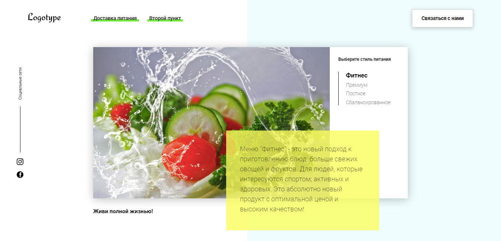

## SPA project of HLS-food delivery service

 

The application can get info about menu and post data from modal forms to server.  

To demonstrate this ability, project is set to JSON-server, so if you are going to run this application on you computer you should run the [JSON-server](https://github.com/typicode/json-server) too.

The project is avlaible to see at [GitPages](https://ivankorolenko.github.io/Food/).

You also can clone this repository, install associated packages and run JSON-server by the next commands:

#### `$ git clone https://github.com/ivankorolenko/Food.git Food`
#### `$ cd Food`
#### `$ npm install`
#### `$ npx json-server db.json`

In this case you previously should become sure that <b>npm</b> is installed on you computer.
